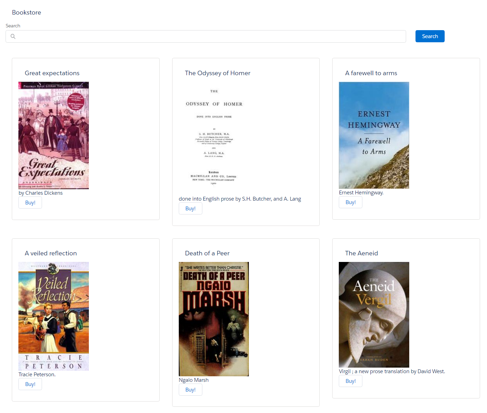

# Candidate Exercise

## Requirements

Let's pretend we want to manage our personal library within Salesforce.
1. As a first step, we want to build a page that lists books displaying
        * the book cover image,
        * title,
        * author and
        * open library Id number (OLID).

2. Please layout the page as per the screenshot below
        (https://bitbucket.org/jamesmelville/candidate-exercise-brian/src/master/)
        but don't invest time making it pixel perfect (we haven't!).

3. We'd also like the form to allow us to filter (on the server side) by the
        * book's title,
        * author
        * or OLID.

The API to get the list of books we want to search is available [here]
        (https://openlibrary.org/api/books?bibkeys=OLID:OL22895148M,OLID:OL6990157M,OLID:OL7101974M,OLID:OL6732939M,OLID:OL7193048M,OLID:OL24347578M,OLID:OL24364628M,OLID:OL24180216M,OLID:OL24948637M,OLID:OL1631378M,OLID:OL979600M,OLID:OL33674M,OLID:OL7950349M,OLID:OL349749M,OLID:OL30460M,OLID:OL24347578M&jscmd=data&format=json). There is a class in this repository named "Library" to help development.

4. Finally, once we've found the book we want to add to the library, we can click a button to save the book to the "Book" object in Salesforce.

5. Create tests with good coverage.

## What we’re looking for

* Good test coverage
* Clean, well-structured code
* Logical approach to implementation

## What is here

- Salesforce DX Repo
- Library class to deserialise API JSON response
- Book object for persistence